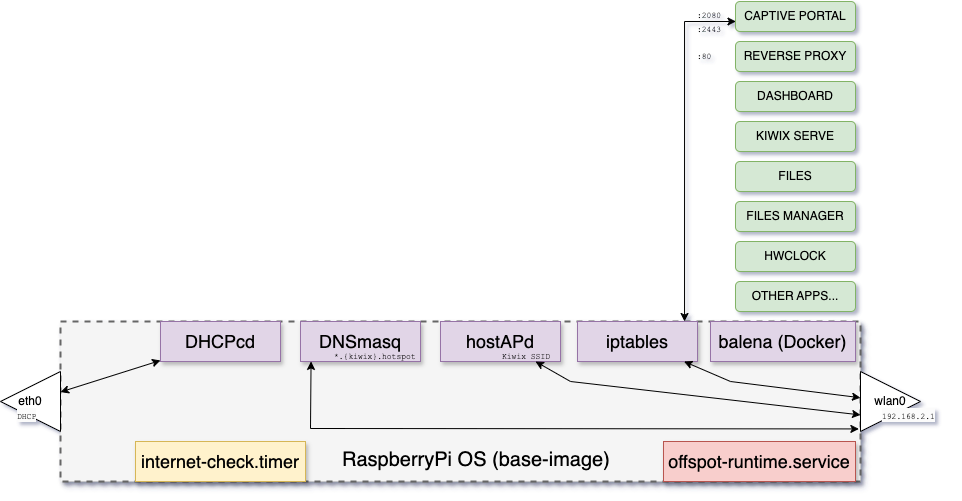
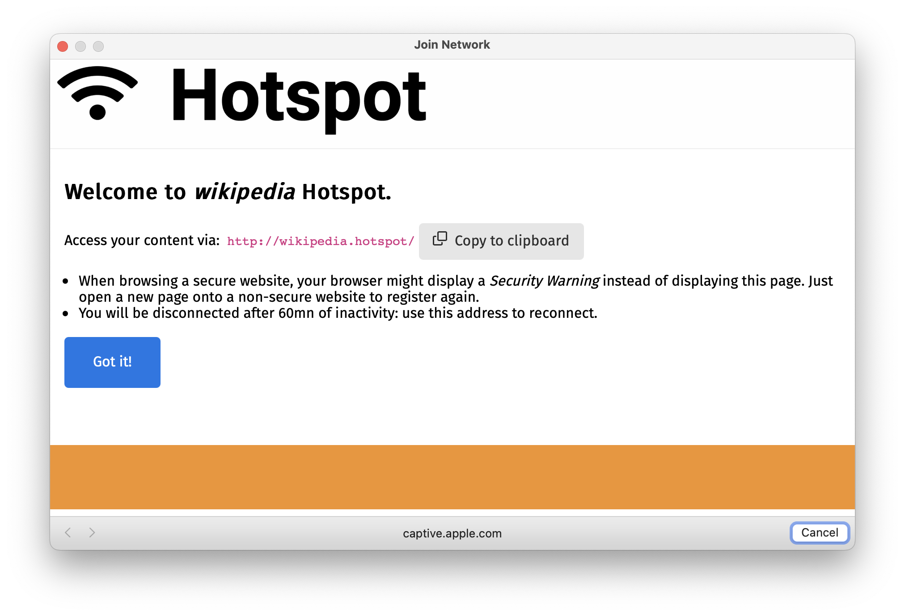
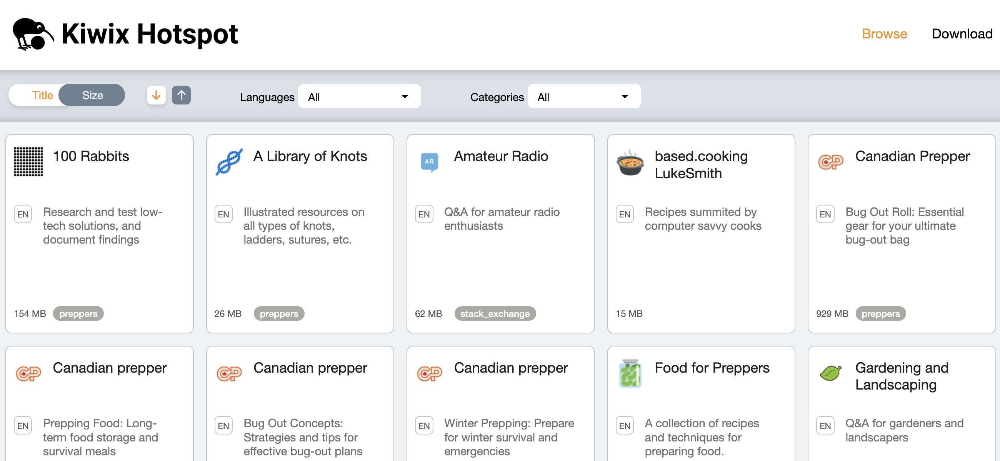

# Kiwix Hotspot

`offspot` is a collection of tools and solutions to support **Kiwix Hotspot**.

A Kiwix Hotspot is a Raspberry Pi computer running a WiFi hotspot and serving content and services over HTTP to the its WiFi clients.
It's a software stack on top of a regular RaspberryPi OS but distributed as an image file.
The resulting system can still be used freely.

➡️ **TUTORIAL:** [Create your own WiFi knowledge hub with Kiwix Hotspot](https://github.com/offspot/overview/blob/main/docs/Kiwix%20Hotspot%20Tutorial.md) ⬅️

---



This diagram demonstates that the Pi OS only runs a couple of services and that all the content and apps are provided via Docker containers.

Using a dockerized approach is key in offering a clean, reliable and maintainable base-system while allowing all sorts of usages and Web Apps.

## Base OS

Our Base OS is called `base-image` and is built on RaspberryOS Lite. Just like RaspberryOS, it is built using pi-gen.

[`base-image`](https://github.com/offspot/base-image) is the repository holding our changes and script to build it. Its output is an IMG file. We host our releases at [drive.offspot.it/base/](https://drive.offspot.it/base/).

You can use it to create a different base image and use it when creating a Kiwix Hotspot. Be sure not to break our key components though.

### Main Changes

- Less packages. A Kiwix Hotspot doesn't need Bluetooth and GPIO for instance.
- Default User: `user` / `raspberry`.
- SSH installed but not started. Connect to console to enable it (`sudo systemctl enable --now ssh`)
- Three partitions layout: `/boot` (`FAT32`), `/` (`ext4`) and `/data` (`ext4`). Root filesystem size is limited ❗
- Custom initial-boot resize script to expand `/data` partition to use all remaining space on device.
- No SWAP.
- Custom WiFi firmwares to support more AP clients than stock firmware.
- Reduced logs to save I/O
- Docker Stack (balena-engine + Docker Compose)
- Automatic Docker images loading on Start
- Internet-connectivity check timer
- DHCP client service configured for eth0 (`dhcpcd`)
- Persistent firewal (`iptables` restore on start)
- DNS Server (`dnsmasq`) orchestrated by offspot-runtime
- WiFI AP (`hostapd`) orchestrated by offspot-runtime
- Offspot-Runtime service on boot to configure or start DNS/AP/etc

## Offspot Runtime

[`offspot_runtime`](https://github.com/offspot/offspot-config), part of `offspot-config` repository is a collection of scripts that are run on every start via `offspot-runtime.service`.

It's goal is two fold:

- Configure the aforementioned tools that are installed on the Host.
- Start those tools.

The configuration part is meant to be run on first boot but can happen at any boot. We chose to configure those things on boot so the image-creation step (`image-creator` below) doesn't need a working system and can remain a dumb file-copying tool.

It also allows dynamically changing some settings which users are kin to customize (SSID, password, etc).

In practice, it is multiple scripts ; each focusing on a *task* (usually operating a single underlying tool) that can be invoked directly, with inputs passed on the CLI.

It's not used this way in general, as its service runs `offspot-runtime-config-fromfile /boot/firmware/offspot.yaml`

> [!IMPORTANT]
> This reads that file and calls all scripts individually with the args corresponding to the config file. As those configs are applied, configuration is removed from the file. In a booted, configured machine, that file is thus an empty YAML document.
> The file is thus changed to **request a configuration change**.

This file is mandatory to configure the Hotspot the first time and the base-image includes a minimnal one.

This file is purposedly stored on `/boot` partition as this one is FAT32 and can thus be modified on all platforms.

Documentation for this file is on [`offspot_config`](https://github.com/offspot/offspot-config)'s README.

## Offspot Config

[`offspot-config`](https://github.com/offspot/offspot-config) is a Python library to build Kiwx Hotspot YAML recipe file that is fed to `image-creator`.

It is used to configure everything as its output is the only input to get a working image file.

At the moment, it's only code but it's quite easy to use.

```py
builder = ConfigBuilder(
    base=BaseConfig(
    source="1.2.1",
    rootfs_size=2663383040,
    ),
    name="My Hotspot",
    domain="my-kiwix",
    welcome_domain="goto.kiwix",
    tld="hotpot",
    ssid="My SSID",
    passphrase="",
    timezone="UTC",
    environ={
        "ADMIN_USERNAME": "admin",
        "ADMIN_PASSWORD": "admin-password",
    },
    write_config=True
)
builder.add_dashboard(allow_zim_downloads=True)
builder.add_captive_portal()
builder.add_reverseproxy()
builder.add_zim(get_zim_package("openZIM:wikipedia_en_climate_change:nopic"))
```

Check out our [Hotspot Tutorial](https://github.com/offspot/overview/blob/main/docs/Kiwix%20Hotspot%20Tutorial.md) for more details or look into Imager Service's code.


## Image Creator

[`image-creator`](https://github.com/offspot/image-creator) is a Linux-only, root-only command-line tool to prepare a Kiwx Hostpo image (IMG) file from an offspot-config-made recipe file.

> [!NOTE]
> Although Linux-only, it runs fine on macOS via Docker (use `--privileged`) and Windows via WSL2.

The recipe includes the URL/path to a base image file that is copied, mounted and modified. Then, the tools downloads all files references in the recipe and places them inside the mounted image at their requested location. Once done, it unmounts everything and boom. You have a ready Kiwix Hotspot image!

The tool includes an [aria2](https://github.com/aria2/aria2) based downloader that ensure files integrity and a flexible Downloads Cache based on `ext4`'s [`user_xatttr`](https://www.man7.org/linux/man-pages/man7/xattr.7.html).

The recipe YAML format and the Cache Policy YAML format are both documented on [`image-creator`](https://github.com/offspot/image-creator)'s README.

## Captive Portal

The [Captive Portal](https://github.com/offspot/captive-portal) is feature that greatly boosts User Experience for Hotspot Clients. When enabled (we always enable it), upon connecting to a Kiwix Hotspot's network, the user is quickly prompted by his Operating System with a special Web Page.
That webpage includes the Hotspot's logo and name, with a brief description so the User knows what's happening.
He is asked to confirm and upon its click, he is redirected to the hotspot's home page (dashboard).

That's the goal: allow anyone to arrive to the dashboard, without having to know any URL or face scary prompts.

> [!WARNING]
> If the hotspot is not connected to the Internet itself (it usually isn't!), some systems (Android, iOS) may tell the user that the network lack Internet connectivity and ask the user to confirm they're OK on this network. That happens post-captive portal though.



Behind the scene, what happens is:

- *Unregistered* IP's HTTP requests are captured by the firewall and directed to this App.
- This welcome message is presented with an invitation to confirm (*register*)
- Upon confirmation, the client's IP is added to the firewall's list of *registered* IPs
- Traffic for *registered* IPs is not captured and can thus access the hotspot.
- Web browser is directed to the hotspot's home page.

There's an expiration on that *registration* so that multiple users sharing a single computer can still benefit from this feature.

## Dashboard

The [`dashboard`](https://github.com/offspot/dashboard/) displays a cards/grid view of the content listed in a `home.yaml` file.

> ![TIP]
> It also offers a special view to download the content for which a download link was supplied. That's very useful to allow users to download ZIM file as well as Kiwix Readers so they can copy from the Hotspot and continue hotspot-less on their Android device for instance



As other Hotspot App, dashboard is a Docker image. It is composed of:

- A static web server (`lighttpd`)
- A script that runs on startup and rebuilds the static page

This allows a somewhat dynamic approach in that one can modify the `home.yaml` file and reboot to get an updated version but still benefit from a static, fast website.

> ![TIP]
> It also features a ZIM discovery feature that checks the ZIM folder and automatically removes from the dashboard those that are not present anymore and adds any new one not listed in `home.yaml`. It does so by querying the ZIM itself for its metadata.
> This happens at startup as well.

Documentation for the Home YAML file is on the [`dashboard`](https://github.com/offspot/dashboard/)'s README.

## Apps

Even though it's not a requirement, we usually create dedicated apps for the hotspot so the image are small.

Our apps are all on [`container-images`](https://github.com/offspot/container-images).

Some of them are special (reverse-proxy, captive-portal) and their integration is built into `offspot-config`, others are more standard.

Those are listed in [`catalog.json`](https://github.com/offspot/offspot-config/blob/main/src/offspot_config/catalog.json) with their integration properties. This `catalog.json` is not standardized at all and will certainly change in the future.

> ![NOTE]
> Some apps in the Catalog are virtual (files packages) as those are simply ZIP files containing an HTML document and support files.
> Those are exposed as individual web-apps to users but it's a single static web server behind the scene.
> We use it for external download content like Android Apps.

---

## Imager Service

[Kiwix Imager Service](https://github.com/offspot/imager-service) is a SaaS platform that provides a Web UI to configure a Hotspot, request it, have it done by a worker, be notified via e-mail with a link once ready, etc.

It's entirely free as the rest of the stack but it's tailored solely to our https://imager.kiwix.org/ needs. Check out its source-code though for samples on how to do those various actions.


---

## Repositories

| Tool                                                              | Description                                                                                                                                                                                                  |
| ----------------------------------------------------------------- | ------------------------------------------------------------------------------------------------------------------------------------------------------------------------------------------------------------ |
| [`base-image`](https://github.com/offspot/base-image)             | raspiOS-like _base_ image builder: adds/removes package, adds some configuration, tweaks and tools, installs `offspot_runtime` (part of `offspot_config`)                                                    |
| [`offspot_runtime`](https://github.com/offspot/offspot-config)    | set of scripts to (re-)configure some stuff on boot: network, WiFi, etc.                                                                                                                                     |
| [`offspot_config`](https://github.com/offspot/offspot-config)     | library for parsing/creating offspot YAML config. Include a Config Builder and an App Catalog                                                                                                                |
| [`image-creator`](https://github.com/offspot/image-creator)       | _somewhat_-generic Image creator taking a YAML config as input. YAML config lists all files to download, and includes a complete docker-compose. This is not user-friendly at all. Linux only, runs as root. |
| [Kiwix Imager Service](https://github.com/offspot/imager-service) | Web UI to select content. Uses the offspot-config builder to produce YAML. Calls image-creator in worker to build image then uploads it. https://imager.kiwix.org                                            |
| Kiwix Imager App                                                  | **Not implemented yet**. kiwix-hotspot replacement. UI to select content and configure. Will use offspot-config builder to gen a YAML and call image-creator                                                 |
| [`dashboard`](https://github.com/offspot/dashboard)               | In-hotspot Web dashboard listing content with metadata and links. Also provides Download of downloadable ones (ZIM files) and Kiwix Readers                                                                  |
| [`container-images`](https://github.com/offspot/container-images) | Kiwix-Hotspot-optimized OCI Images for our apps ; including the reverse-proxy, kiwix, etc.                                                                                                                   |
