# Boot from NVMe

> [!INFO]
> Kiwix Hotspot supports booting from NVME so you can follow anyother guide online ; this is just a reference.

By default, all RaspberryPi are configured to boot from SD-card.

If you want to boot from an NVMe disk or even USB, you need to update the Pi's bootloader.

> [!IMPORTANT]
> Only Pi5 supports NVMe.
> If you have a Pi4, you can boot off a USB stick in a similar manner though.

You can do this on a running Pi with `sudo rpi-eeprom-config --edit`. We use `0xf146` for NVMe ➡️ USB ➡️ SD.

As our use case is to change device bootloader's in batch, we'll describe the rpi-imager method instead.

[Upstream documentation](https://www.raspberrypi.com/documentation/computers/raspberry-pi.html#nvme-ssd-boot)

# Flash your NVMe disk

Flash your image onto the M.2 NVMe disk (via an NVME reader) using rpi-imager. This works the same as for SD-card.

## Enable PCI Express Gen.3

> [!WARN]
> Only do this is your NVMe HAT supports it (Argon NEO 5 M.2 NVME does)
> Pi5 is certified for Gen 2.0 speeds (5 GT/sec) but can be forced to Gen 3.0 (8.0 GT/s)
> Argon40 [recommends](https://cdn.shopify.com/s/files/1/0556/1660/2177/files/FOR_WEB_INSTRUCTION_MANUAL_NEO_5_M.2_NVMe_20240909.pdf?v=1725870016) enabling it.


To enable it, make sure the file `/boot/firmware/config.txt` on the **running system** (those are read at every boot) contains `dtparam=pciex1_gen=3` in the `[all]` section.

**From the running device**:

```sh
❯ echo "dtparam=pciex1_gen=3" | sudo tee -a /boot/firmware/config.txt
```

It can be disabled the same way.

> [!TIP] 
> You can do this right after imaging your NVMe disk


1. Physically detach the disk as rpi-imager would have unmounted it
2. Physically attach it again
3. Run the following command (assuming macOS host)


```sh
❯ echo "dtparam=pciex1_gen=3" | tee -a /Volumes/bootfs/config.txt
```

Make sure to eject the filesystems before unplugging.


# Prepare a bootloader update SD-card

You only need to do this once. Then you can keep that SD-card aside (or re-do the same process next time you need it).

You can use the smallest SD-card you have as this takes very minimal space.

## Select “Choose OS”

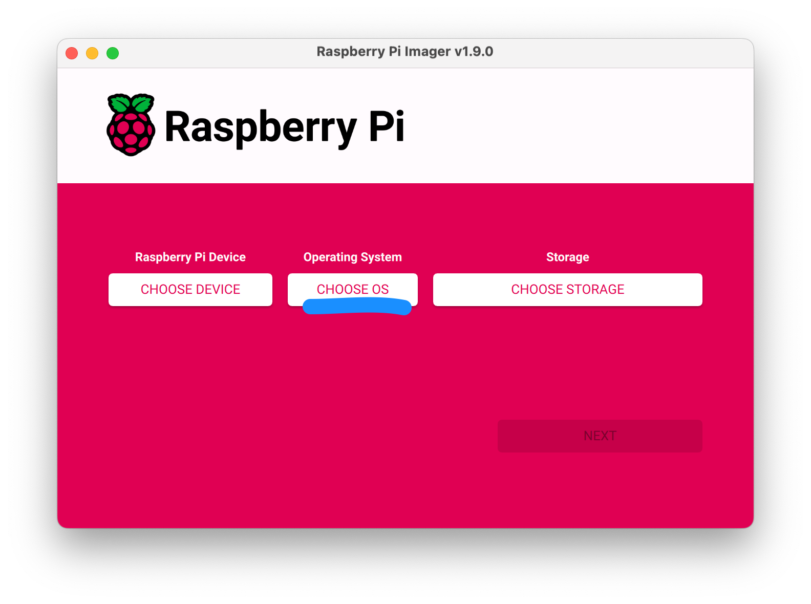

## Find “Misc Utility images”

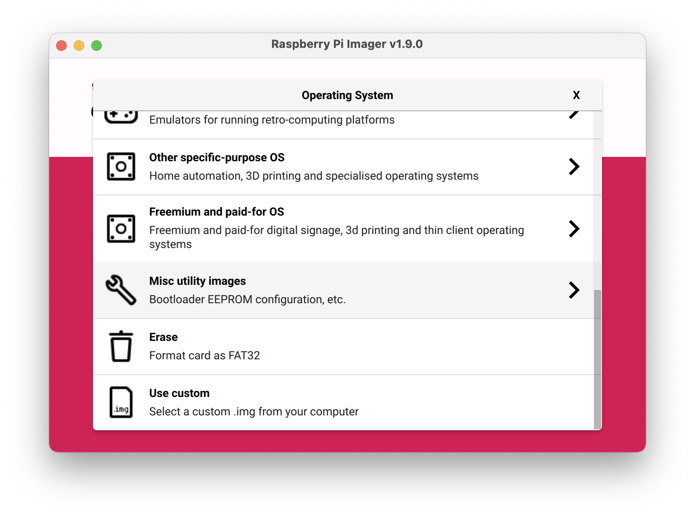

## Select “Bootloader”

Choose the one appropriate for your Pi. In our use case, we want NVMe which is only compatible with Pi5.

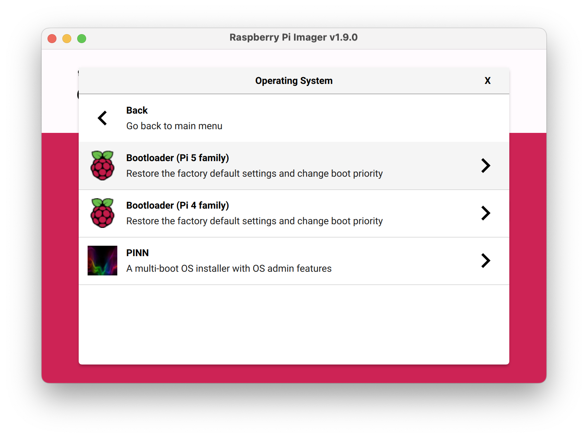

## Select “NVMe/USB Boot”

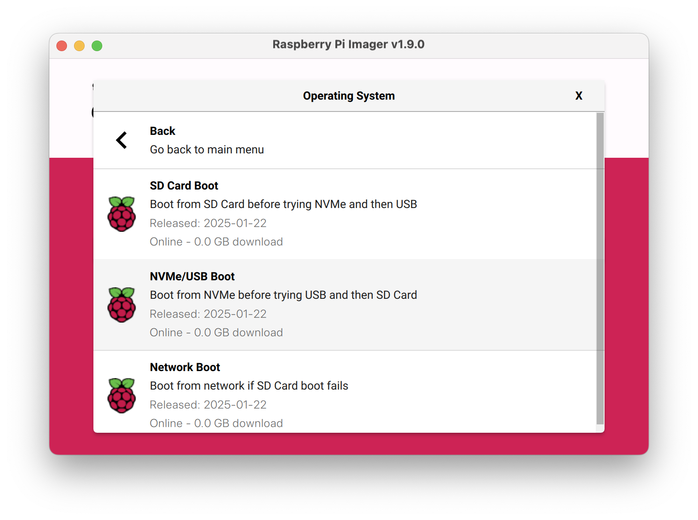

## Select “Choose Storage”

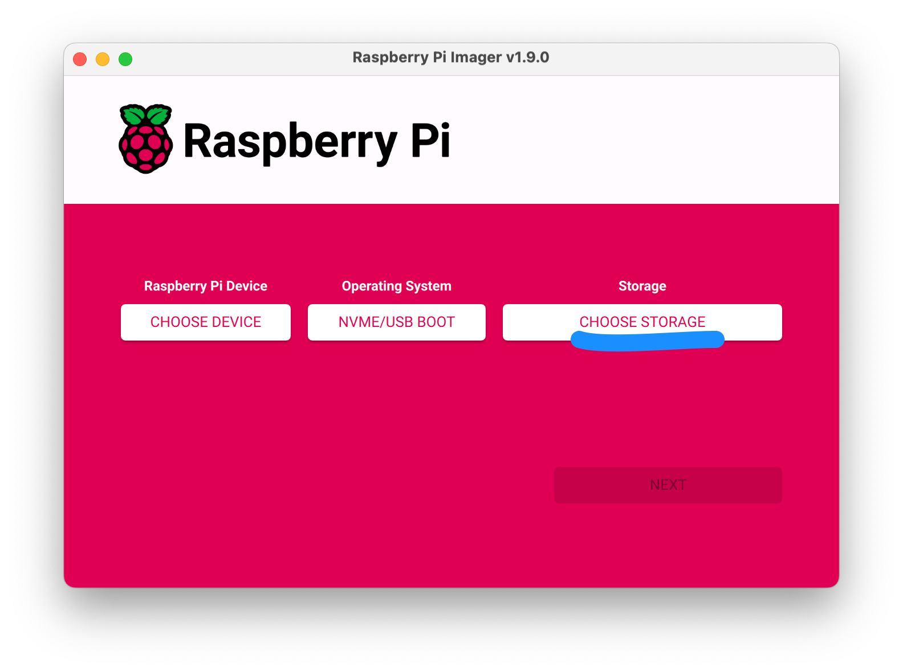

## Select your SD-card in list

Your SD-card (not your NVMe disk) should be attached obviously at this stage).

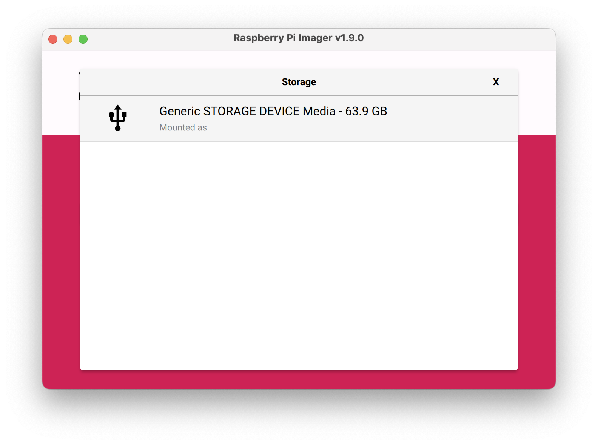

## Click on “Next”

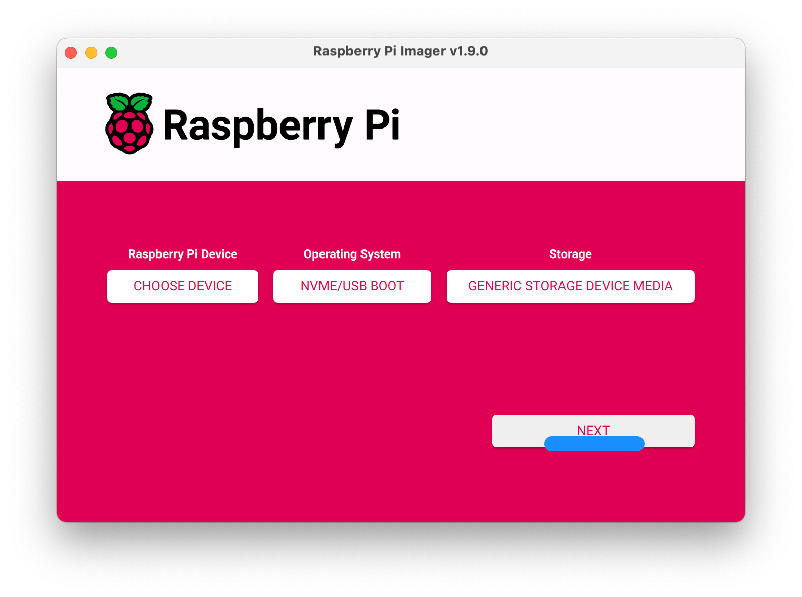

## Select “YES” to confirm SD-card erasal
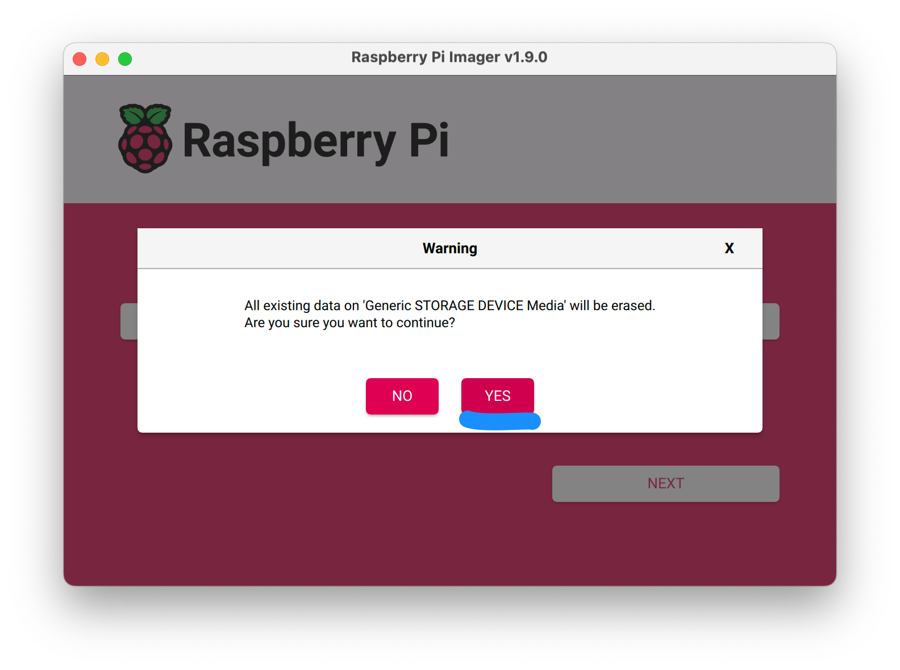

## Await completion

Don't cancel verification ; it should all take only a couple minutes at most.

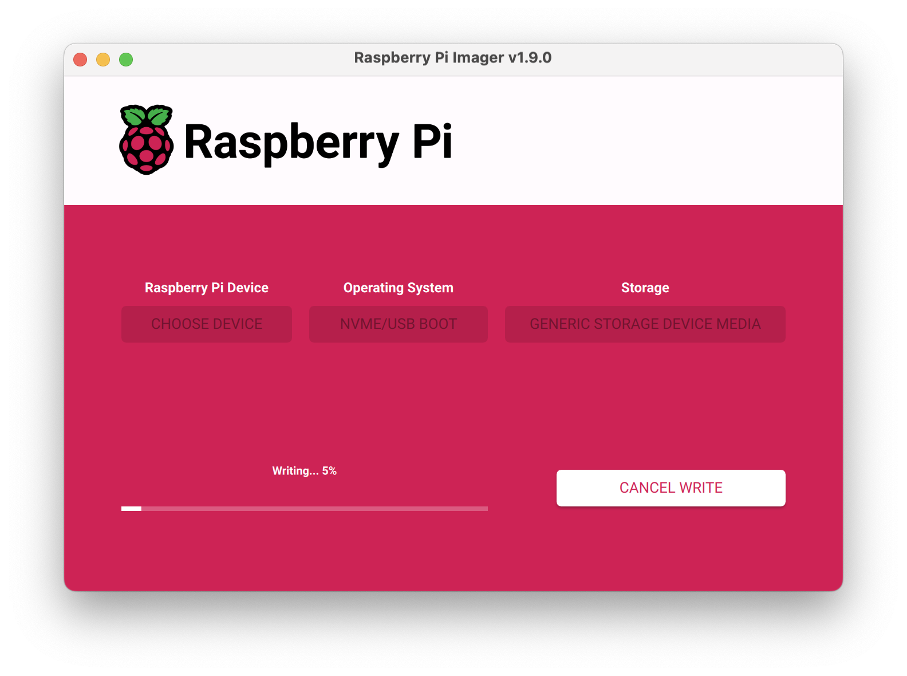
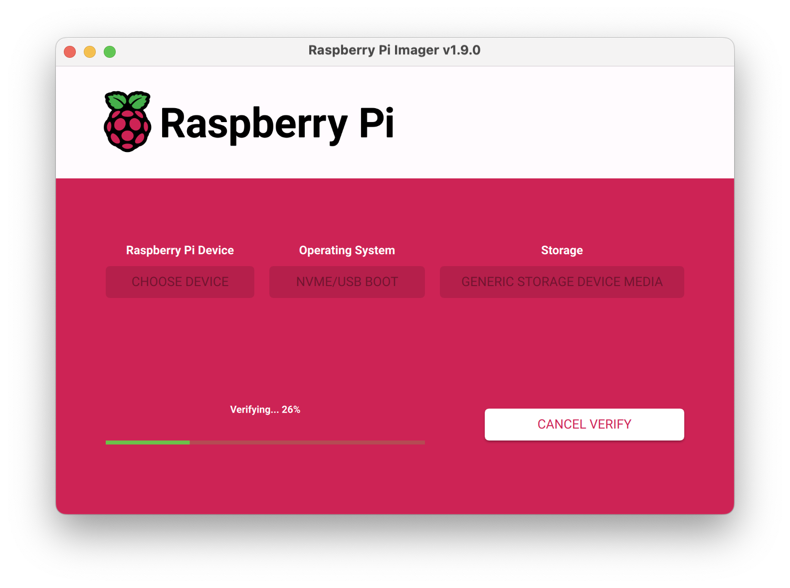

## Eject your SD-card

Your SD-card is ready

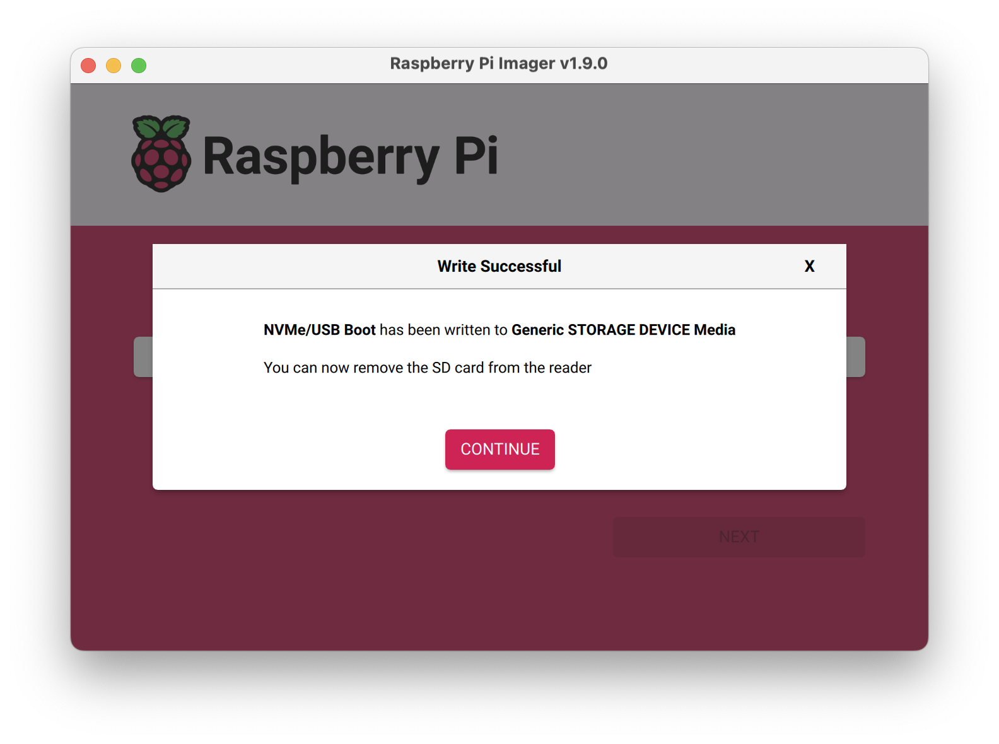


# Update bootloader

Insert the SD-card into your Pi and **wait 15 seconds**.

If successful, the **green LED** on the Raspberry Pi **will blink rapidly forever**.

If the LED is blinking differently, there has been an error.

If an HDMI display is attached, then the screen will display **green for success** or red if a failure occurs.