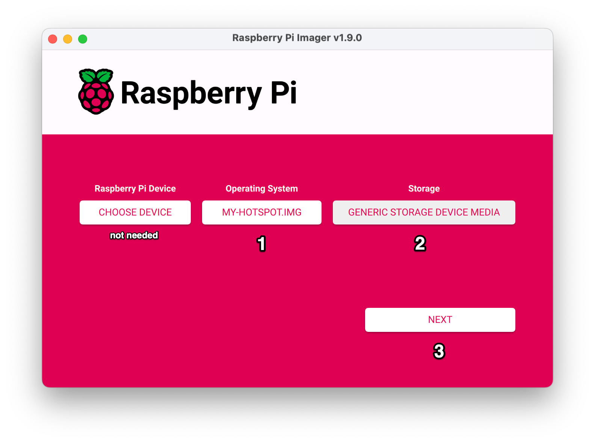
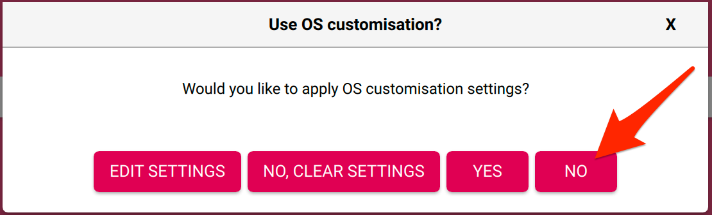

# Create your own WiFi knowledge hub with Kiwix Hotspot

> [!TIP]
> If you're just interested in such an Hotspot but are not into DIY, check-out [Kiwix's Website](https://kiwix.org/en/wifi-hotspot/).

A *Kiwix Hotspot* is a WiFi network that anyone (or those with its password) can connect to and get prompted with a list of Web-resources replicas to access directly. No Internet access required. Only a Raspberry Pi, it's SD card and a source of power for the Pi.

> [!WARNING]
> This guide is intended for DIY enthusiasts that are computer savvy.
> You'll be mostly using the command-line and even writing some very simple copy-paste-able code.
> Nothing difficult but you will need to figure out by yourself how to access the tools mentioned.


## Gathering Hardware

Hardware is very simple but there are a couple of things not to overlook.

- A **64b Raspberry Pi**. That's the only hardware we support.
- Don't use a Pi Zero2W just yet. We don't support it (we will though).
- **Appropriate Power Supply** for your Pi. Using an underated (or poor quality) power supply can lead to very weird issues that you wont be able to diagnose or even link to the power supply. Various Pi models have various requirements. See below. As all are 5V rated, using an higher capacity one is OK.
- **New, good quality SD-card**. In many cases, the SD-card speed will be your bottleneck. SD-card is somewhat fragile and degrades over use. Decent ones are cheap enough for you not to get the cheapest which will lead to trouble. There's no guidance on finding good quality ones but using a popular brand (Sandisk, Samsung) is usually enough.

| Pi Model   | Min. Wattage | Min Amps |
| ---------  | ------------ | -------- |
| `Zero2W`   | 12.5W        | 2.5A     |
| `3`        | 12.5W        | 2.5A     |
| `4`/`400`  | 15W          | 3A       |
| `5`/`500`  | 27W          | 5A       |

> [!NOTE]
> Out of scope for this guide but it's possible to use an SSD instead of an SD-card for better speed and reliability.
> Make sure you master SD-card version first though.

## Step 1: identify the content you want to include

Believe it or not, this is the most tedious and difficult step yet that's the only one we can't really help you with.

> [!IMPORTANT]
> If following this guide for the first time, just find a couple of small content or use our suggestions.
> Once you have completed all the steps and it's working as expected, you can restart from here with
> your carefuly curated content list. You dont want typos and long downloads to come in the way and lead
> to long and frustrating attempts.

**Suggestion**:

```
openZIM:wikipedia_en_climate_change:nopic
openZIM:raspberrypi.stackexchange.com_en_all:all
```

The's a notion of *Title ID* in Kiwix Hotspot that's not really exposed anywhere so you'll have to construct them yourself:

1. Find your wanted content on https://library.kiwix.org/ and click on it.
2. Spot the ID part in URL. For https://library.kiwix.org/viewer#archlinux_en_all_nopic_2022-12/A/Main_page it's `archlinux_en_all_nopic_2022-12`.
3. Change URL to get the `Name`, `Publisher` and `Flavour` metadata with the URLs as https://library.kiwix.org/raw/archlinux_en_all_nopic_2022-12/meta/Name. Change trailing `Name` to `Publisher` and `Flavour` to get them. If `Flavour` URL is 404, it means Flavour is empty.
4. Construct ID as `{Publisher}:{Name}:{Flavour}` so `Kiwix:archlinux_en_all:nopic` for this one.

Keep a list of your IDs, you'll need them for next step.

All of them must be three part, separated by `:`. Last part can be empty.


## Step 2: Build the Image's YAML recipe

That's the scary code-involving step. The approach here is to provide you with a sample source file that constructs and image YAML file
from some variables at the top. This way, you can simply change those variables and you should be good to go.
If you're comfortable with Python, go crazy!

This step requires a **working Python3** installation. You can use WSL2 on Windows or Docker if you prefer:

```sh
# getting a shell with a working Python setup using Docker
❯ docker run -v $PWD:/data -it python:3.11-bookworm bash
```

If you dont use Docker, make sure to be on an isolated virtualenv:

```sh
❯ python3 -m venv tuto-env && source tuto-env/bin/activate
```

First, install required dependencies:

```sh
❯ pip install offspot-config
```

Now copy the [`tuto-builder.py`](tuto-builder.py) script and edit its variables on the top of the file.

Run the file once satisfied:

```sh
❯ python tuto-builder.py
Preparing YAML Config file…
> Adding Readers
> Adding Dashboard
> Adding Captive Portal
> Adding Reverse-proxy
> Adding ZIMs
>  - Adding openZIM:wikipedia_en_climate_change:nopic
>  - Adding openZIM:raspberrypi.stackexchange.com_en_all:all
> Adding Packages
>  - Adding file-manager.offspot.kiwix.org
> Adding Clock
> Adding Metrics
Rendering YAML Config file…
Writing YAML to conf.yaml
Done.
```

You file is ready for next step.

## Step 3: Build the Image (downloads everything)

### Check requirements

This step requires you to be **root on a GNU/Linux machine**. You can use WSL2 on Windows or Docker (`--privileged`) if you don't have access to a Linux machine.

First, download the lastest version of [`image-creator`](https://github.com/offspot/image-creator) [from the drive](https://drive.offspot.it/image-creator/): `1.1.3` as I'm writing.

Make sure all requirements are satisfied by running it without valid inputs:

```sh
❯ ./image-creator conf.yaml out.img

  _                                                      _
 (_)_ __ ___   __ _  __ _  ___        ___ _ __ ___  __ _| |_ ___  _ __
 | | '_ ` _ \ / _` |/ _` |/ _ \_____ / __| '__/ _ \/ _` | __/ _ \| '__|
 | | | | | | | (_| | (_| |  __/_____| (__| | |  __/ (_| | || (_) | |
 |_|_| |_| |_|\__,_|\__, |\___|      \___|_|  \___|\__,_|\__\___/|_|
                    |___/                                       v1.1.3|py3.11.9


[2025-02-10 10:23:24] :: Checking system requirements
[2025-02-10 10:23:24]    => Checking uid
[2025-02-10 10:23:24]    => Checking binary dependencies  Missing binaries: dmsetup, partprobe, qemu-img
[2025-02-10 10:23:24]    => Checking loop-device capability
[2025-02-10 10:23:24]    => Checking ext4 support

Requirements
------------

kernel features:
    - `loop` must be enabled in your kernel or as a module
       if running inside a docker-container:
        - same loop feature applies to host's kernel
        - container must be run with --privileged
    - `ext4` filesystem (most likely enabled in-kernel)

tools:
    - losetup (mount)
    - parted (parted)
    - resize2fs (e2fsprogs)
    - mount (mount)
    - umount (mount)
    - qemu-img (qemu-utils)
    - partprobe (parted)
    - mknod (coreutils)
    - dmsetup (dmsetup)

Sample setup (debian)
sudo modprobe --first-time loop
sudo modprobe --first-time ext4
sudo apt-get install --no-install-recommends coreutils dmsetup                                              mount e2fsprogs qemu-utils parted
Step CheckRequirements returned 2
[2025-02-10 10:23:24]  Cleaning-up ..
[2025-02-10 10:23:24]  Cleaning-up ..
```

Missing requirements will be printed if any. **Sort this out first**!

### Build the image

Now run it referencing **your actual YAML config** from previous step. Make sure to check `--help` also.

It is recommended to use a cache so that any subsequent attempt does not require re-downloading everything but it can be [cumbersome to configure](https://github.com/offspot/image-creator?tab=readme-ov-file#cache-policy) and this cache-dir **must be on an ext4** filesystem.

```sh
❯ mkdir -p cache
❯ printf "enabled: true\nmax_size: 100GiB\n" > cache/policy.yaml
❯ ./image-creator --cache-dir $(pwd)/cache conf.yaml out.img

  _                                                      _
 (_)_ __ ___   __ _  __ _  ___        ___ _ __ ___  __ _| |_ ___  _ __
 | | '_ ` _ \ / _` |/ _` |/ _ \_____ / __| '__/ _ \/ _` | __/ _ \| '__|
 | | | | | | | (_| | (_| |  __/_____| (__| | |  __/ (_| | || (_) | |
 |_|_| |_| |_|\__,_|\__, |\___|      \___|_|  \___|\__,_|\__\___/|_|
                    |___/                                       v1.1.3|py3.11.9


[2025-02-10 11:04:05] :: Checking system requirements
[2025-02-10 11:04:05]    => Checking uid
[2025-02-10 11:04:05]    => Checking binary dependencies
[2025-02-10 11:04:05]    => Checking loop-device capability
[2025-02-10 11:04:05]    => Checking ext4 support
[2025-02-10 11:04:05] :: Checking config inputs
[2025-02-10 11:04:05]    => Reading config from /conf.yaml
[2025-02-10 11:04:05]    => Parsing config data
[2025-02-10 11:04:05]    => Making sure base and output are different
[2025-02-10 11:04:05]    => Checking target path
[2025-02-10 11:04:05]    => Testing target location  /out.img
[2025-02-10 11:04:05] :: Checking Cache Policy
[2025-02-10 11:04:05]    => Checking user_xattr support at /cache
[2025-02-10 11:04:05]    => Reading cache policy at /cache/policy.yaml
[2025-02-10 11:04:05]    => Preparing cache at /cache
[2025-02-10 11:04:05] :: Enforcing Cache Policy
[2025-02-10 11:04:05]    => No entry to evict
[2025-02-10 11:04:05] :: Checking all Sources
[2025-02-10 11:04:05]    => Checking https://drive.offspot.it/base/offspot-base-arm64-1.2.1.img  3.23 GiB
[2025-02-10 11:04:05]    => Checking https://mirror.download.kiwix.org/release/kiwix-desktop/kiwix-desktop_windows_x64_2.4.1.zip  125.95 MiB
[...]
```

You now have a `.img` file that is your *Raspberry Image File*.

## Step 4: Flash the Image onto the SD-card

This is standard and you can use any tool you'd prefer for this.

We recommend you [Download](https://www.raspberrypi.com/software/) and use **`rpi-imager`**.

1. In *Operrating System*, select *Use Custom* at the very end of the list and pick the `.img` file you buyilt in previous step.
2. In *Storage*, select your SD-card (ity must be attached to your computer obviously).
3. Hit Next
4. **Dont apply OS customisation**. This is not compatible with Kiwix Hotspot and will prevent it from booting.
5. Once writing is complete, **don't cancel verify**. It's an essential step in trusting your SD-card.





You SD-card is now ready and can be removed from your computer.

## Step 5: First-boot and Go

Insert your SD-card into the Pi and turn it on. You don't need to plug in a keyboard or a screen as it's meant to be connected to from other devices over WiFi.

**Be patient** during first boot as there is a file-system expansion step (so all free sapce on your SD card is available), a filesytem check then the device is rebooted and actual first boot happen with containers creation.

Then use a phone or laptop to connect to the new WiFi network named after your chosen SSID. You'll be prompted with the captive portal that will take you to the dashboard. **Enjoy!**


### Beyond the tutotial

All of this is free software available on Github. It's very flexible but barely documented. Feel free to ask questions on the Issue Tracker though!

If you wan to gain SSH access, you'll have to enable it from a running Pi (using a screen and a keyboard). Console credentials are `user` / `raspberry`. Enable SSH with `sudo systemctl enable --now ssh`.

You can also change the SSID and password among other things by tweaking the `/boot/offspot.yaml` file. Check its [documentation](https://github.com/offspot/offspot-config).

Check out the `/data` partition content. You can manually add ZIM files into `/data/contents/zims/` and after a reboot, they'll appear on the dashboard.

Except for the WiFi Access Point (`hostapd`), everything related to Kiwix Hotspot runs as Docker containers so there's little risk for you to break anything. Go wild, it's your machine after all!
